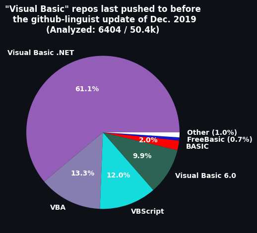

# Visual-Basic-Repo-Data

## Context

On the 7th of December 2019, GitHub started making the difference between different flavors of Visual Basic (VB.Net, VB6, VBA and VBScript). Before that, any repo that would contain a specific flavor of Visual Basic would only get the blanket language label "Visual Basic".

However, GitHub only changes the language associated to a repo when a commit is pushed to it. This means that all repos that haven't been pushed to since then will still have the old "Visual Basic" language label.

This is mainly a problem for projects that are trying to assess the popularity of each languages. They can't know what is the correct language from the GitHub API as they will likely get the old/stale language label. This can create bias in the data.

## Solution

This repo is collecting data on all the repos that haven't been updated since 2019-12-07 and it include the specific language it is associated with using the same tool that GitHub normally uses to assess the language of a repo (github-linguist).

This way, it is possible for project preoccupied by language popularity to correct old data.

As of writting this, the collect is ongoing and should be completed in early 2025.

## Data

The data is supplied in the CSV format. All files are store in the `data` subdirectory and are separated by year. The entry for a repo will be in the CSV for the year it was last pushed to.

The columns definitions are the following:

- slug: Author_Name/Repo_Name
- last_commit_date: The last time a commit was made to the repo.
- language: Name of the language associated with that repo using modern tool to determine.
- determination_tool: Name and version of the tool used to determine the language of the repo.
- determination_date: When was the language determined.
