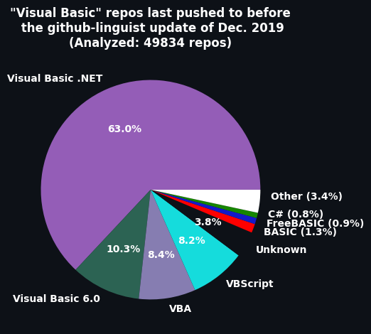

# Visual-Basic-Data

## Context

On the 7th of December 2019, GitHub started making the difference between flavors of Visual Basic (VB.Net, VB6, VBA and VBScript). Before that, any repo that would contain a specific flavor of Visual Basic would only get the blanket language label "Visual Basic".

However, for this change to take effect on a repo, a commit needs to be pushed to it. That's because GitHub won't update the language label of a repo unless something has changed. This means that all repos that haven't been pushed to since that major update will still have the old "Visual Basic" language label.

This is mainly a problem for projects that are trying to assess the popularity of each languages. They can't know what is the correct language from the GitHub API as they will likely get the old/stale language label. This can create bias in the data.

Note that the "Visual Basic" label was simply renamed to "Visual Basic .NET" in December 2019 which means that the new name appears in some places causing even more confusion.

## Solution

This repo is collecting data on all the repos that haven't been updated since 2019-12-07. It determines the specific language label for each repo using the same tool that GitHub normally uses to assess the language of a repo: [github-linguist](https://github.com/github-linguist/linguist).

This way, it is possible for project preoccupied by language popularity to correct old data.

As of writting this, the collect is ongoing and should be completed in early 2025.

## Data

The data is supplied in the CSV format.
The columns definitions are the following:

- slug: Author_Name/Repo_Name
- last_commit_date: The last time a commit was made to the repo.
- language: Name of the language associated with that repo using modern tool to determine.
- determination_tool: Name and version of the tool used to determine the language of the repo.
- determination_date: When was the language determined.
